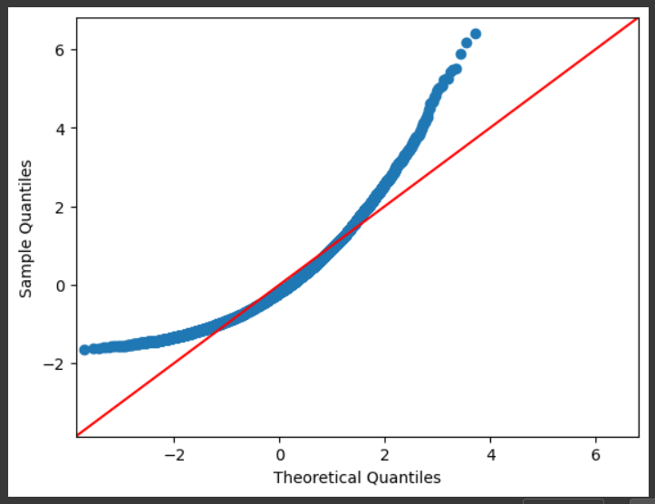
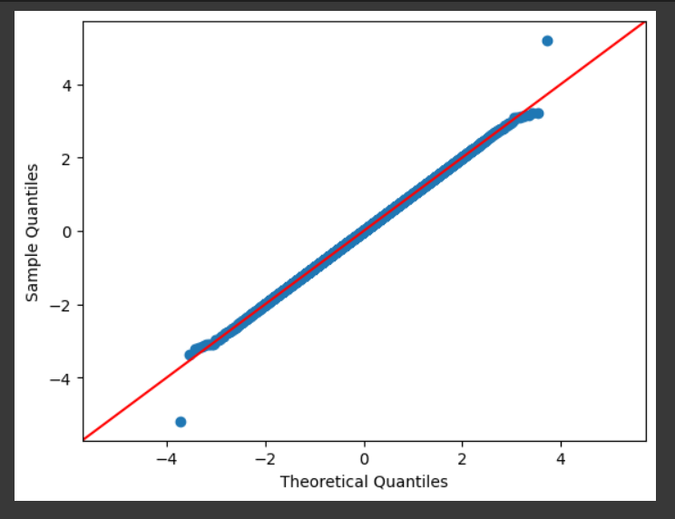

# Ex-06-Feature-Transformation
### Aim:
To find future transformation using python
## Equipment’s required:
1.	Hardware – PCs
2.	Anaconda – Python 3.7 Installation / Moodle-Code Runner
## ALGORITHEM
STEP 1
Read the given Data

STEP 2
Clean the Data Set using Data Cleaning Process

STEP 3
Apply Feature Generation techniques to all the feature of the data set

STEP 4
Save the data to the file
## PROGRAM 
```

import numpy as np
import pandas as pd
import matplotlib.pyplot as plt
import statsmodels.api as sm
import scipy.stats as stats
from sklearn.preprocessing import QuantileTransformer
df = pd.read_csv('Data_to_Transform.csv')
df

sm.qqplot(df.HighlyPositiveSkew,fit=True,line='45')
plt.show()

sm.qqplot(df.HighlyNegativeSkew,fit = True,line='45')
plt.show()

sm.qqplot(df.ModeratePositiveSkew	,fit = True,line='45')
plt.show()

sm.qqplot(df.ModerateNegativeSkew	,fit = True,line='45')
plt.show()

df["Highly Positive Skew"] = np.log(df.HighlyPositiveSkew)
sm.qqplot(df.HighlyPositiveSkew,fit=True,line='45')
plt.show()

df["Highly Positive Skew"] = 1/df.HighlyPositiveSkew
sm.qqplot(df.HighlyPositiveSkew,fit=True,line='45')
plt.show()

df["Highly Positive Skew"] = np.sqrt(df.HighlyPositiveSkew)
sm.qqplot(df.HighlyPositiveSkew,fit=True,line='45')
plt.show()


from sklearn.preprocessing import PowerTransformer
transformer = PowerTransformer("yeo-johnson")
df['ModerateNegativeSkew']=pd.DataFrame(transformer.fit_transform(df[['ModerateNegativeSkew']]))
sm.qqplot(df['ModerateNegativeSkew'],line='45')
plt.show()

from sklearn.preprocessing import QuantileTransformer
qt = QuantileTransformer(output_distribution = "normal")
df['ModerateNegativeSkew'] = pd.DataFrame(qt.fit_transform(df[['ModerateNegativeSkew']]))
sm.qqplot(df['ModerateNegativeSkew'],line='45')
plt.show()
```
## OUTPUT





## RESULT
The program is excicuted sucssfully excicuted